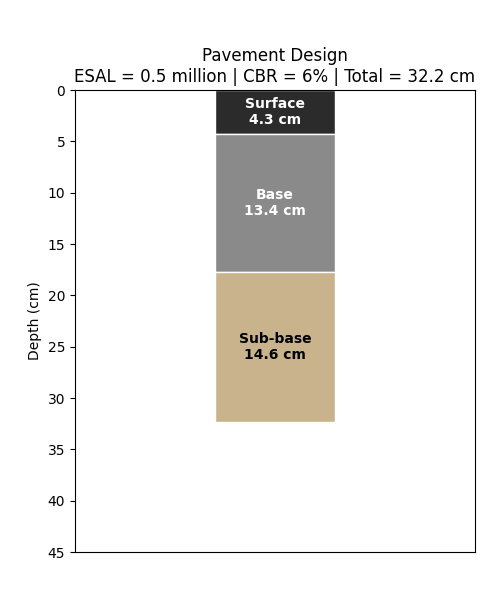

# Pavement Design Calculator

A small Python tool that estimates flexible pavement layer thicknesses
(surface, base, sub-base) using a simplified version of the AASHTO
empirical design method.



## What it does

- Computes the required Structural Number (SN) from traffic load (ESAL)
  and subgrade strength (CBR)
- Splits the SN into surface, base, and sub-base layer thicknesses
- Generates an animated chart showing how layer thickness grows as
  traffic load increases

## Assumptions

- Flexible (asphalt) pavement, not rigid (concrete)
- Typical AASHTO layer coefficients (surface 0.44, base 0.14, sub-base 0.11)
- Layer proportions fixed at 35% / 35% / 30% of the total Structural Number
- Simplified subgrade modulus estimate: MR (MPa) ≈ 10.3 × CBR

This is a simplified educational model, not a substitute for a full
AASHTO 1993 design using the official nomograph/reliability tables.

## Usage

```bash
python pavement.py
```

```python
from pavement import design_pavement

result = design_pavement(esal_millions=5, cbr=6, reliability=0.90)
print(result)
```

## Files

- `pavement.py` — core design calculations
- `make_animation.py` — generates `pavement_animation.gif`
- `pavement_animation.gif` — visual output
